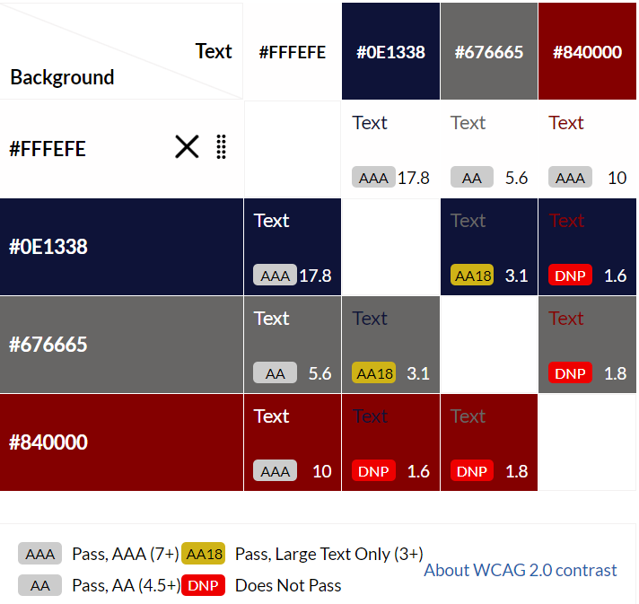

# Seafood Brasserie

Seafood Brasserie is a restaurant on the coast of Cork, Ireland. They market themselves as the leaders of fresh seafood restaurant for dinner in their area.

The website provides basic information about the high class restaurant for ease of use. With the About section and Menu on one page. With the call to action to book button at the top and at the end of the page. The booking system is on the 2nd page and will allow people to see the available times for a dinner sitting, the dates the restaurant is open, the amount of people they can book for, special requests such as a birthday candle in dessert, and terms and conditions. Terms and conditions such as "You have the table for 2 hours" and "Incase of no-show the table will be given away after 20 minutes." etc.

The owner wanted the website to offer a quick view of the restaurant menu and ease of booking online, to reduce phone calls to the restuarant. This will help people to not get dissapointed if they show up without a booking also.

**Link to** [live site](https://8000-mags07-postgresql-obt5w03e29.us2.codeanyapp.com/)

Full website designer, myself: [Margarita Buyukli LinkedIN](https://www.linkedin.com/in/margarita-buyukli-b16477a6/)

## Contents

- [Seafood Brasserie](#seafood-brasserie)
  - [Contents](#contents)
  - [Market Research](#market-research)
    - [Competitor Analysis](#competitor-analysis)
  - [Business Goals](#business-goals)
    - [Scope](#scope)
    - [Specifications](#specifications)
  - [User Experince](#user-experince)
    - [First Time Visitor Goals](#first-time-visitor-goals)
    - [Returning Visitor Goals](#returning-visitor-goals)
  - [Design](#design)
    - [Colour Scheme](#colour-scheme)
    - [Typography](#typography)
    - [Images \& Video](#images--video)
    - [Logo](#logo)
    - [Wireframes](#wireframes)
    - [Features](#features)
  - [Technologies](#technologies)
    - [Languages](#languages)
    - [Libraries \& Other Tools](#libraries--other-tools)
  - [Testing](#testing)
  - [Deployment](#deployment)
  - [Credits](#credits)
    - [Articles](#articles)
    - [Acknowledgements](#acknowledgements)
    - [Content](#content)
    - [Media](#media)
  - [Codeanywhere Reminders](#codeanywhere-reminders)

## Market Research

### Competitor Analysis

- **Competitor 1**

[The Anchor Inn](https://www.tripadvisor.com/Restaurant_Review-g315857-d6883492-Reviews-The_Anchor_Inn-Crosshaven_County_Cork.html)
Customer pain points:

- They dont have a website
- There is no menu visible or pricing
- Only have a phone number to contact them.
- Not clear if they take oookings io if it's only walk-ins

- **Competitor 2**

[Mad Fish](https://www.tripadvisor.com/Restaurant_Review-g315857-d2244797-Reviews-Mad_Fish-Crosshaven_County_Cork.html)
Customer pain points:

- They dont have a website
- There is no menu visible or pricing
- Only have a phone number to contact them.
- Not clear if they take oookings io if it's only walk-ins
 
 

## Business Goals

### Scope

2 pages

- Home - About us, and the dinner menu. Call to book button at the top and bottom of the page. Contact us and working hours, after the bottom call to book button.
- Bookings - A page dedicated to reservations. Will include: The available dates, the available time, the available number of seats, speacial requests, and terms and conditions. 

### Specifications

- **Aspects of a website to address pain points of visitors**
- Minimalist style - straight to the point.
- A couple of dish photos(from <https://pixabay.com/> <https://unsplash.com/> )
- Menu including the dishes and drinks available, and the prices.
- Mouse hovering reactions to catch attention to links, call to booking buttons.
- Contact details at the bottom incase of special questions such as dietary needs.

## User Experince

### First Time Visitor Goals

- See the short information about the restaurant and get the feel of their style.
- Have an easy access to the up-to date menu, including drinks and food with the prices.
- Have an easy access to the social media links such as Instagram, Youtube and Facebook.
- Have an easy assess to their TripAdvisor Page to see review.
- To see the opening and closing times and what days the restaurant is open.
- Be able to book online at any time of the day that suits me.
- Be able to contact the business owner as I wish through social media, e-mail or phone number.
- Find the address to the restaurant.

### Returning Visitor Goals

- Be able to book the restaurant by clicking the booking button without needing to scrol through the first page.
- Have an easy access to contact the restaurant incase I need to change or cancel a booking, wheather I feel more comformatable doing it over social media, email or a phone call.
- See the up-to-date manu and prices being offered if it's been a while since I went there.
- See the address of the restaurant incase it's been a while since I went there.

## Design

### Colour Scheme

Inspiration from [Coastal Seafoods](https://www.coastalseafoods.com/Themes/Default/Content/Images/fortune-fish-gourmet-seafood.jpg)

Colour Scheme chosen from [Coolors](https://coolors.co/)

Visual colour accessability analitics
[Contrast Grid Eightshapes](https://contrast-grid.eightshapes.com/)

### Typography

- [Google Fonts](https://fonts.google.com/)

  - Used 'Lora' font for the logo and headings as it looks professional.
  - Used 'Syne' for for the main body writing as it is rounded, looks a little casual.

### Images & Video

All images are from [Pexels](https://www.pexels.com/)

### Logo

Logo icon from [Favicon](https://favicon.io/)

### Wireframes

- Wireframes were created using [Balsamiq](https://balsamiq.com/)
<!--Balsamiq Wireframes here-->

### Features

Navigation
Hero in Home page - catch attention
Welcome - about us
Benefits

Footer
Hero images in the rest of the website
Imagery - movement and opaques to catch attention
Links for ease of navigation through the website without call to action being too presuring.

Future Features
Booking online without contact to be able to see availability before commiting to booking.

[Back to contents](#contents)

## Technologies

<https://grid.layoutit.com/>

### Languages

- [HTML5](https://www.w3schools.com/html/default.asp/)

  - Used for the creation of the website content.

- [CSS3](https://www.w3schools.com/Css/default.asp/)

  - Cascading Style Sheets language used to style individual pages.

[Back to contents](#contents)

### Libraries & Other Tools

- 
  - helps with

- [Grid Layout It](https://grid.layoutit.com/)

- [GitHub](https://github.com/)

  - Hosting service for software development.

- [FontAwesome](https://fontawesome.com/)

  - Icon library and toolkit.

- [Lighthouse](https://developer.chrome.com/docs/lighthouse/overview/)

  - Audit the site for performance, quality, best practices and SEO.

- [AmIResponsive](https://ui.dev/amiresponsive/)

  - An online tool to check how responsive the website is on different screen sizes. Screenshot of this is provided in the begining of README.

- [Markup Validation Service](https://validator.w3.org/)

  - Validator checks the markup validity of Web documents in HTML.

- [CSS Validation Service](https://jigsaw.w3.org/css-validator/)

  - Online tool validates CSS.

[Back to contents](#contents)

## Testing

Testing process and results can be found [here](https://github.com......md).

## Deployment

The site was deployed to GitHub pages: [Github](https://github.com/)
The steps to deploy are as follows:
In the GitHub repository, navigate to the Settings tab.
From the left hand menu select 'Pages'
From the source select Branch: main
Click 'Save'
A live link will be displayed when published successfully. It may take about 5 minutes.
The live link can be found here: <https://mags07.github.io/Sauna-Beach-Spa/index.html>

[Back to contents](#contents)

## Credits

- Grid Template Layout
<https://www.youtube.com/watch?v=Pip8s2BpelM&ab_channel=SixMinutes.Smarter>.

### Articles

-
-

### Acknowledgements

- [w3schools.com](https://www.w3schools.com/w3css/tryit.asp?filename=tryw3css_templates_gourmet_catering&stacked=h) for the html template.
- [Stackoverflow](https://stackoverflow.com/) community that have answered alot of similar questions I had.
- Google search engine for the overload of information on website development.

### Content

- The text for the Home page was taken from;
- The icon in the logo and the social media icons in the footer [Font Awesome](https://fontawesome.com/)

[Back to contents](#contents)

### Media

- The photos used :
- The video used:

Welcome,

This is the Code Institute student template for Codeanywhere. If you are using Gitpod then you need [this template](https://github.com/Code-Institute-Org/gitpod-full-template) instead.  We have preinstalled all of the tools you need to get started. It's perfectly ok to use this template as the basis for your project submissions.

You can safely delete this README.md file, or change it for your own project. Please do read it at least once, though! It contains some important information about Codeanywhere and the extensions we use. Some of this information has been updated since the video content was created. The last update to this file was: **August 30th, 2023**

## Codeanywhere Reminders

To run a frontend (HTML, CSS, Javascript only) application in Codeanywhere, in the terminal, type:

`python3 -m http.server`

A button should appear to click: _Open Preview_ or _Open Browser_.

To run a frontend (HTML, CSS, Javascript only) application in Codeanywhere with no-cache, you can use this alias for `python3 -m http.server`.

`http_server`

To run a backend Python file, type `python3 app.py`, if your Python file is named `app.py` of course.

A button should appear to click: _Open Preview_ or _Open Browser_.

In Codeanywhere you have superuser security privileges by default. Therefore you do not need to use the `sudo` (superuser do) command in the bash terminal in any of the lessons.

To log into the Heroku toolbelt CLI:

1. Log in to your Heroku account and go to _Account Settings_ in the menu under your avatar.
2. Scroll down to the _API Key_ and click _Reveal_
3. Copy the key
4. In Codeanywhere, from the terminal, run `heroku_config`
5. Paste in your API key when asked

You can now use the `heroku` CLI program - try running `heroku apps` to confirm it works. This API key is unique and private to you so do not share it. If you accidentally make it public then you can create a new one with _Regenerate API Key_.

---

Happy coding!
